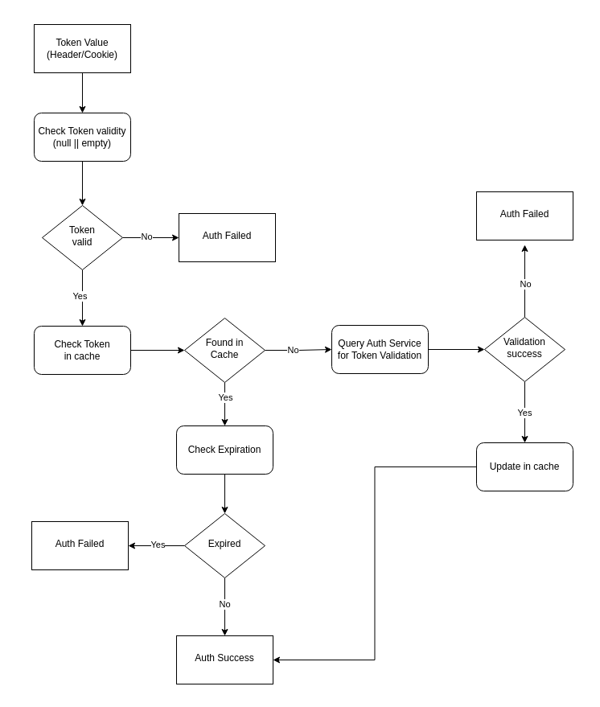

# AuthClient Architecture: High-Level Overview

AuthClient consist following main components:

- AuthClient library
- Cache Component
- AuthService Servers

AuthClient comprises three key components that work together seamlessly:

1. **Driver Component** provides an API that allows to validate/invalidate token by passing necessary information, query
   cache component and if needed then query AuthService server to validate token. It is also responsible for load
   balancing multiple instances of auth service.
2. **Cache Component** provides the amazingly fast cache operations to perform for an userId and auth token. It supports
   add, get and delete operation on cache.
3. **AuthService Server** acts as source of truth for token stored in cache. Whenever token is not found in cache then
   auth service will be responsible for the token validation.